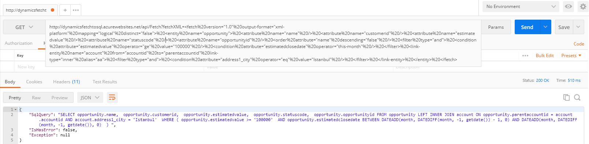

# Dynamics CRM Fetch XML Query To Sql Query
### Convert From Dynamics CRM Fetch XML string to SQL Query



It is a simple project for convert 'Dynamics CRM 365 Fetch XML' string to SQL Query.
2 projects are included in the solution. One of them is an engine and another one is an API project.
Also, api address is like below. You can call it from browser or postman

### How it works

It just parse fetch XML string and create sql query.
Dynamics CRM has over 90 operators in advance find. This solution compensates over 60 operators.

https://dynamicsfetchtosql.azurewebsites.net/api/Fetch?fetchXML=

You need the add your fetch XML string to the end as parameter. The resulting class is like 

```
public class ReturnObject
{
    public ReturnObject();

    public string SqlQuery { get; set; }
    public bool IsHasError { get; set; }
    public string Exception { get; set; }
}
```

##### NOTE : 

To the checking Fetch XML structure, I create an azure blob container and upload a xsd file to this blob. 
You can explore the xsd file from this link : https://crmfetch.blob.core.windows.net/files/fetch.xsd

#### Missing features

If you find bug or have an idea or want to improve solution, please feel free to contact me.
